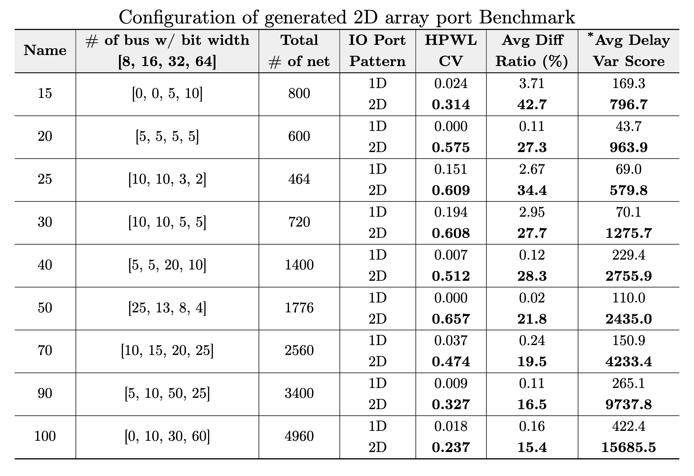

# Benchmark Description
To emulate a new bus routing challenges(e.g., 2D-placed bus pins), we developed a new bus routing benchmark by extending the ICCAD 2018 benchmark[1]. First, we construct nine distinct netlists varying in bus width/count configurations. Then for each netlist, we create two floorplan variants, 1D-placed and 2D-placed by changing chip width, width, height, pin placement, and routing blockages. The 1D set is included specifically to highlight that the 2D pin placement exhibits larger intra-bus HPWL variation compared to the 1D case. In total, we provide a set of 18 routing benchmarks designed to evaluate bus routing under different I/O pin configurations:

### 1D_placed_designs (Total 9 benchmarks)
  - bus_design_XX
      - bus_XX_def.tar.gz
      - bus_XX.png
  - 9 benchmarks with conventional 1-dimensional pins

### 2D_placed_designs (Total 9 benchmarks)
  - bus_design_XX
      - bus_XX_def.tar.gz
      - bus_XX.png
  - 9 benchmarks with 2-dimensional pins
        
These benchmarks are derived from the original bus and blockage patterns and extended to introduce 2D placed pins. All benchmark layouts were implemented using a commercial Place-and-Route (P&R) tool. The 2D placed benchmarks were constructed through custom DEF generation.

## Bus Configuration
Each benchmark includes combinations of four bus widths:
- 8-bit, 16-bit, 32-bit, and 64-bit
- The number of buses is varied to represent different routing congestion scenarios.

## Pin Placement Structure
- 1D pin Benchmarks: All input/output pins are placed along the die boundary.
- 2D pin Benchmarks:
  - Input pins remain on the die boundary.
  - Output pins are placed inside the die as 2-dimensional array pins, modeled after TSV-based connections.
  - Each 2D pin uses a 5 × 5 µm² metal pad on the M5 layer, matching top BEOL via dimensions and routing track pitch.

## Routing and Blockage Configuration
- Routing uses four metal layers (M3–M6).
- pins are located on M5.
- Routing blockages are inserted on M3 and M4 to represent already-utilized routing resources from logic placement, effectively constraining available routing space for buses.

# Reference
[1] A. Liao, H. Chang, O. Chi, and J. Wang. (2018). ”ICCAD 2018 CAD Contest Obstacle-Aware On-Track Bus Routing” [Online]. Available: http://iccad-contest.org/2018/Problem B/2018ICCADContest ProblemB.pdf
